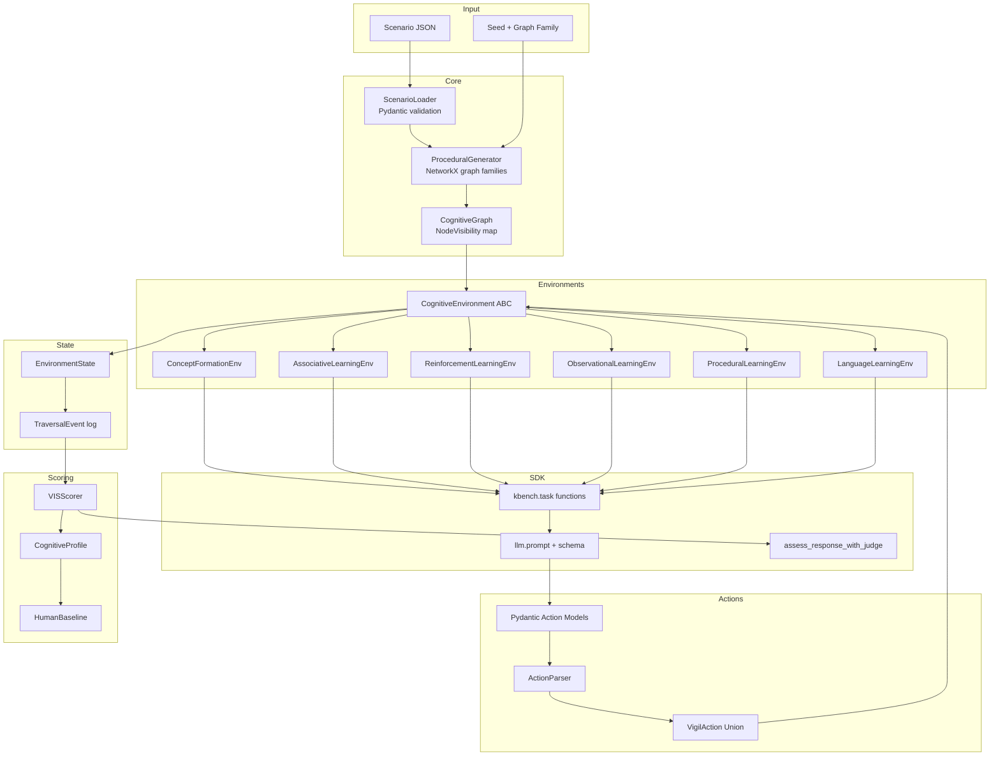
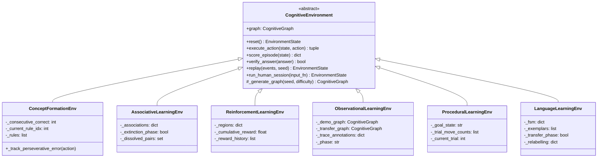

# Design Document: Vigil Benchmark Framework

## Overview

Vigil is a stateful cognitive graph benchmark framework for the Google DeepMind × Kaggle "Measuring AGI" Hackathon (Track 1: Learning). Rather than static QA datasets, Vigil places AI models inside partially-observable graph environments and measures *how* they navigate — the traversal path is the cognitive measurement.

The framework implements:
- A fog-of-war POMDP visibility system enforcing partial observability
- Event-sourced state management for full trajectory replay
- Four structured action tools with Pydantic validation
- Six learning sub-ability environments (WCST, Paired-Associate, IGT, Bandura, Tower of Hanoi, Reber Grammar)
- A 7-dimensional Vigil Intelligence Score (VIS) combining outcome (30%) and process (70%)
- Procedural graph generation across four graph families
- Full Kaggle Benchmarks SDK integration

### Key Design Principles

1. **Partial observability is enforced structurally** — the three-layer visibility system (UNEXPLORED → DISCOVERED → EXPANDED) is the only mechanism by which graph information reaches the model. There is no bypass.
2. **All state is event-sourced** — `EnvironmentState` is always derivable by replaying `TraversalEvent` logs. This enables exact reproducibility and behavioral scoring.
3. **NetworkX is the only graph library** — zero external infrastructure, all in-memory Python.
4. **Pydantic for all structured I/O** — actions, scenario configs, and scores are all validated.
5. **Judge LLM for MC dimension only** — all other six VIS dimensions are algorithmic.

---

## Architecture

### High-Level Component Diagram



### Data Flow

```
Scenario JSON → ScenarioLoader → ProceduralGenerator(seed, family) → CognitiveGraph
                                                                           ↓
LLM ← llm.prompt(observation) ← CognitiveEnvironment.render(state) ← EnvironmentState
 ↓
VigilAction (Pydantic) → CognitiveEnvironment.execute_action() → TraversalEvent → EnvironmentState
                                                                                        ↓
                                                              VISScorer.score_episode() → VIS score → @kbench.task returns float
```

---

## Components and Interfaces

### Class Hierarchy



### CognitiveGraph (Updated)

`vigil/graphs/core.py` — adds the fog-of-war visibility layer.

```python
class NodeVisibility(Enum):
    UNEXPLORED = "unexplored"
    DISCOVERED = "discovered"
    EXPANDED   = "expanded"

class CognitiveGraph:
    nodes: Dict[str, GraphNode]
    edges: Dict[str, List[GraphEdge]]
    hidden_rule: Optional[str]
    _visibility: Dict[str, NodeVisibility]   # NEW

    def init_visibility(self, start_node: str) -> None: ...
    def set_visibility(self, node_id: str, v: NodeVisibility) -> None: ...
    def get_visibility(self, node_id: str) -> NodeVisibility: ...
    def get_agent_view(self) -> Dict[str, Any]: ...  # filters UNEXPLORED
```

`get_agent_view()` returns a dict with:
- EXPANDED nodes: `{id, features, edge_types}` — no `category`
- DISCOVERED nodes: `{id, edge_types}` — no features, no category
- UNEXPLORED nodes: omitted entirely

### Action API (Updated)

`vigil/actions/schemas.py` — replaces dataclasses with Pydantic models.

```python
class ExploreAction(BaseModel):
    action_type: Literal["explore"]
    node_id: str

class InspectAction(BaseModel):
    action_type: Literal["inspect"]
    node_id: str

class GetContextAction(BaseModel):
    action_type: Literal["get_context"]

class SubmitAnswerAction(BaseModel):
    action_type: Literal["submit_answer"]
    answer: str
    justification: str
    confidence: float  # 0.0–1.0

VigilAction = Annotated[
    Union[ExploreAction, InspectAction, GetContextAction, SubmitAnswerAction],
    Field(discriminator="action_type")
]
```

Action costs:
| Action | Budget cost |
|---|---|
| `explore` | 2 |
| `inspect` | 1 |
| `get_context` | 0 |
| `submit_answer` | 0 |

Validation rules:
- `explore`: `node_id` must be a direct neighbor of current node and must exist in graph
- `inspect`: `node_id` must not be UNEXPLORED
- Budget-consuming actions rejected when `budget_remaining == 0`

### Event-Sourced State

`vigil/environments/base.py` — adds `TraversalEvent` and event sourcing.

```python
class EventType(Enum):
    EXPLORE       = "explore"
    INSPECT       = "inspect"
    GET_CONTEXT   = "get_context"
    SUBMIT_ANSWER = "submit_answer"
    ERROR         = "error"

@dataclass
class TraversalEvent:
    timestamp: float          # time.time()
    event_type: EventType
    node_id: Optional[str]
    params: Dict[str, Any]    # raw action parameters
    observation: str          # text returned to model
    state_delta: Dict[str, Any]  # budget_delta, visibility_changes, etc.

@dataclass
class EnvironmentState:
    current_node: str
    visited_nodes: List[str]
    budget_remaining: int
    evidence_nodes: List[str]
    action_history: List[TraversalEvent]   # replaces List[GraphAction]
    confidence_history: List[float]
    episode_done: bool = False
```

`CognitiveEnvironment` gains:
```python
def replay(self, events: List[TraversalEvent], seed: int) -> EnvironmentState: ...
```

### ProceduralGenerator (New)

`vigil/graphs/generators.py`

```python
class GraphFamily(Enum):
    ERDOS_RENYI        = "erdos_renyi"
    BARABASI_ALBERT    = "barabasi_albert"
    WATTS_STROGATZ     = "watts_strogatz"
    STOCHASTIC_BLOCK   = "stochastic_block_model"

class ProceduralGenerator:
    def generate(
        self,
        family: GraphFamily,
        seed: int,
        size_factor: float,
        difficulty_config: Dict[str, Any]
    ) -> CognitiveGraph: ...

    def _build_topology(self, family, n, seed) -> nx.DiGraph: ...
    def _assign_features(self, G, seed) -> None: ...
    def _embed_hidden_rule(self, G, rule_config, seed) -> None: ...
    def _randomise_ordering(self, G, seed) -> CognitiveGraph: ...
```

Generation pipeline per call:
1. Build topology via NetworkX (`nx.erdos_renyi_graph`, `nx.barabasi_albert_graph`, `nx.watts_strogatz_graph`, `nx.stochastic_block_model`)
2. Assign node features from a seeded feature pool
3. Embed hidden rule into graph structure
4. Randomise node ID assignment order (seed-controlled)
5. Randomise edge ordering (seed-controlled)
6. Wrap in `CognitiveGraph` with `init_visibility(start_node)`

### VISScorer (New)

`vigil/scoring/vis.py`

```python
class VISScorer:
    def score_episode(
        self,
        state: EnvironmentState,
        final_answer: str,
        justification: str,
        scenario_config: Dict[str, Any],
        judge_llm=None
    ) -> Dict[str, float]: ...

    def compute_exploration_efficiency(self, state) -> float: ...
    def compute_learning_rate(self, state, scenario_config) -> float: ...
    def compute_adaptivity(self, state) -> float: ...
    def compute_recovery(self, state) -> float: ...
    def compute_stopping_quality(self, state, optimal_steps) -> float: ...
    def compute_metacognition(self, state, justification, judge_llm) -> float: ...
    def compute_contamination_risk(self, state) -> float: ...
```

VIS formula:
```
VIS = 0.3 × Outcome_Score + 0.7 × Process_Score

Process_Score = w_EE×EE + w_LR×LR + w_AD×AD + w_RE×RE + w_SQ×SQ + w_MC×MC
                (weights from scenario config, sum to 1.0; CR is a flag, not a weight)
```

Dimension implementations:
- **EE**: `len(evidence_nodes) / len(visited_nodes)` — 0.0 if no visits
- **LR**: slope of per-trial performance curve, normalised to human baseline slope
- **AD**: `1 - perseveration_rate` where perseveration = fraction of actions repeating a contradicted strategy
- **RE**: `1 / mean_steps_to_productive_after_dead_end` — 0.5 if no dead ends
- **SQ**: `1 - |actual_steps - optimal_steps| / optimal_steps`
- **MC**: `assess_response_with_judge` fraction of rubric criteria passed (isolated `kbench.chats.new("judge")` context)
- **CR**: composite of path directness, exploration-before-execution ratio, learning curve variance

If CR > 0.8: `contamination_warning = True` in returned dict.

### Kaggle SDK Integration

`vigil/tasks/track1_learning.py` — six `@kbench.task` functions.

Game loop pattern:
```python
@kbench.task(name="concept_formation_learning")
def concept_formation_task(llm) -> float:
    env = ConceptFormationEnv(...)
    state = env.reset()
    for turn in range(30):                          # hard 30-turn cap
        if state.episode_done or state.budget_remaining <= 0:
            return 0.0
        obs = env.render(state)
        action = llm.prompt(obs, schema=VigilAction) # Pydantic schema enforced
        state = env.execute_action(state, action)
        if state.episode_done:
            vis = VISScorer().score_episode(state, ...)
            return vis["vis"]
    return 0.0
```

MC scoring uses isolated judge context:
```python
with kbench.chats.new("judge"):
    mc_score = kbench.assertions.assess_response_with_judge(
        criteria=rubric_from_traversal(state),
        response_text=justification,
        judge_llm=kbench.judge_llm
    )
```

---

## Data Models

### NodeVisibility Enum

```python
class NodeVisibility(Enum):
    UNEXPLORED = "unexplored"   # node existence unknown to model
    DISCOVERED = "discovered"   # id + edge type visible; features hidden
    EXPANDED   = "expanded"     # id + features visible; category hidden
```

### TraversalEvent

```python
@dataclass
class TraversalEvent:
    timestamp: float
    event_type: EventType
    node_id: Optional[str]
    params: Dict[str, Any]
    observation: str
    state_delta: Dict[str, Any]
    # state_delta keys: budget_delta (int), visibility_changes (dict[str, str]),
    #                   evidence_added (list[str]), episode_done (bool)
```

### EnvironmentState

```python
@dataclass
class EnvironmentState:
    current_node: str
    visited_nodes: List[str]          # ordered visit history
    budget_remaining: int
    evidence_nodes: List[str]         # nodes relevant to hidden rule
    action_history: List[TraversalEvent]
    confidence_history: List[float]
    episode_done: bool = False
    cumulative_reward: float = 0.0    # used by ReinforcementLearningEnv
    trial_move_counts: List[int] = field(default_factory=list)  # ProceduralLearningEnv
```

### Pydantic Action Models

```python
class ExploreAction(BaseModel):
    action_type: Literal["explore"]
    node_id: str

class InspectAction(BaseModel):
    action_type: Literal["inspect"]
    node_id: str

class GetContextAction(BaseModel):
    action_type: Literal["get_context"]

class SubmitAnswerAction(BaseModel):
    action_type: Literal["submit_answer"]
    answer: str
    justification: str
    confidence: float = Field(ge=0.0, le=1.0)

VigilAction = Annotated[
    Union[ExploreAction, InspectAction, GetContextAction, SubmitAnswerAction],
    Field(discriminator="action_type")
]
```

### ScenarioConfig (Pydantic)

```python
class DifficultyLevel(BaseModel):
    num_nodes: int
    num_categories: int
    features_per_node: int

class ScenarioConfig(BaseModel):
    scenario_id: str
    cognitive_track: str
    sub_ability: str
    graph_config: Dict[str, Any]
    hidden_rule: Dict[str, Any]
    scoring_weights: Dict[str, float]
    difficulty_levels: Dict[str, DifficultyLevel]
    budget: Dict[str, int]

    @validator("scoring_weights")
    def weights_sum_to_one(cls, v):
        if abs(sum(v.values()) - 1.0) > 0.01:
            raise ValueError(f"scoring_weights must sum to 1.0, got {sum(v.values())}")
        return v
```

### VIS Score Dict

```python
{
    "vis": float,                    # 0.0–1.0
    "outcome_score": float,
    "process_score": float,
    "exploration_efficiency": float,
    "learning_rate": float,
    "adaptivity": float,
    "recovery": float,
    "stopping_quality": float,
    "metacognition": float,
    "contamination_risk": float,
    "contamination_warning": bool,
    "human_percentile": Optional[float]
}
```

### HumanBaseline

```python
@dataclass
class HumanBaseline:
    scenario_id: str
    participants: List[Dict[str, float]]  # per-participant VIS dimension scores
    n: int

    def compute_percentile(self, vis_score: float, dimension: str) -> float: ...
```

Stored as `vigil/baselines/{scenario_id}_baseline.json`.

---

## Environment-Specific Design Notes

### ConceptFormationEnv (WCST Analog)

- Rule shift triggers after 10 consecutive correct `submit_answer` calls
- Perseverative errors: actions that apply the pre-shift rule after shift notification
- Difficulty: level 1 = 9 nodes / 2 categories, level 2 = 15 / 3, level 3 = 24 / 4
- `inspect` returns features only — never category

### AssociativeLearningEnv (Paired-Associate Analog)

- Hidden association edges are not labelled as "association" — they appear as generic edges
- Extinction phase: previously valid associations dissolved; model notified of phase start but not which pairs
- `_execute_expand` validates neighbor reachability (bug fix from Req 4)

### ReinforcementLearningEnv (IGT Analog)

- Four regions: 2 high-immediate/net-negative, 2 modest/net-positive
- Stochastic reward drawn from region schedule on each `explore`
- Budget: 100 actions (sufficient for reward schedule learning)
- `get_context()` includes `cumulative_reward`

### ObservationalLearningEnv (Bandura Analog)

- Phase 1: demonstration graph with trace annotations on edges
- Phase 2: transfer graph — structurally isomorphic, different node IDs and feature labels
- `inspect` on a node adjacent to a traced path returns trace annotations
- Scoring evaluates abstract strategy match, not path identity

### ProceduralLearningEnv (Tower of Hanoi Analog)

- State-space graph: nodes = procedure states, edges = valid moves
- Invalid move (non-existent edge): error observation, no state advance
- Minimum 10 trials; `trial_move_counts` recorded in state
- LR computed via power-law fit of move count vs trial number

### LanguageLearningEnv (Reber Grammar Analog)

- FSM grammar generated procedurally from episode seed (not from training corpora)
- 20 exemplar valid paths exposed before classification trials
- Transfer condition: same grammar, fully relabelled node IDs and features
- Classification trial: model calls `submit_answer` with "grammatical" or "ungrammatical"

---

## Correctness Properties

*A property is a characteristic or behavior that should hold true across all valid executions of a system — essentially, a formal statement about what the system should do. Properties serve as the bridge between human-readable specifications and machine-verifiable correctness guarantees.*

### Property 1: Visibility initialisation invariant

*For any* `CognitiveGraph` initialised with a given start node, every node except the start node has visibility `UNEXPLORED`, and the start node has visibility `EXPANDED`.

**Validates: Requirements 1.2**

---

### Property 2: Explore updates visibility

*For any* `CognitiveEnvironment` and any valid `explore(node_id)` action, after execution: `node_id` has visibility `EXPANDED`, and every direct neighbor of `node_id` has visibility at least `DISCOVERED`.

**Validates: Requirements 1.3**

---

### Property 3: Agent view excludes unexplored nodes

*For any* `CognitiveGraph` in any visibility state, `get_agent_view()` contains no node whose visibility is `UNEXPLORED`, and every DISCOVERED node in the view contains only its identifier and edge types (no features, no category), and every EXPANDED node contains features but not its category.

**Validates: Requirements 1.5, 1.6, 1.7, 1.9, 5.1**

---

### Property 4: Action costs are exact

*For any* environment state with sufficient budget, executing `explore` deducts exactly 2, executing `inspect` deducts exactly 1, and executing `get_context` or `submit_answer` deducts exactly 0 from `budget_remaining`.

**Validates: Requirements 2.2, 2.3, 2.4, 2.5**

---

### Property 5: Budget exhaustion rejects consuming actions

*For any* environment state where `budget_remaining == 0`, any `explore` or `inspect` action is rejected and `budget_remaining` remains 0.

**Validates: Requirements 2.8**

---

### Property 6: Invalid actions do not mutate state

*For any* environment state, if an action fails Pydantic validation or fails environment-level validation (non-existent node, UNEXPLORED inspect target, non-neighbor explore target), the state is unchanged and budget is not deducted.

**Validates: Requirements 2.6, 2.7, 2.9, 4.1**

---

### Property 7: Every action appends a TraversalEvent

*For any* action executed (including failed actions), `len(state.action_history)` increases by exactly 1.

**Validates: Requirements 3.3, 3.6, 8.1, 8.2**

---

### Property 8: TraversalEvent contains all required fields

*For any* executed action, the resulting `TraversalEvent` contains non-null values for `timestamp`, `event_type`, `observation`, and `state_delta`.

**Validates: Requirements 3.2**

---

### Property 9: Replay determinism

*For any* list of `TraversalEvent` objects and any seed, two calls to `replay(events, seed)` produce `EnvironmentState` objects that are field-for-field identical.

**Validates: Requirements 3.4, 3.5**

---

### Property 10: Inspect populates evidence_nodes

*For any* node that is evidence-relevant (belongs to a category contributing to the hidden rule), after `inspect(node_id)`, `node_id` appears in `state.evidence_nodes`.

**Validates: Requirements 6.1**

---

### Property 11: Efficiency metric uses action_history length

*For any* `EnvironmentState`, `compute_efficiency(state, optimal)` uses `len(state.action_history)` as the action count, and returns `0.0` when `len(state.action_history) == 0`.

**Validates: Requirements 8.1, 8.3**

---

### Property 12: ProceduralGenerator is deterministic

*For any* `GraphFamily` and seed, two calls to `ProceduralGenerator.generate(family, seed, ...)` produce `CognitiveGraph` objects with identical node sets, edge sets, feature assignments, and hidden rules.

**Validates: Requirements 9.2**

---

### Property 13: Different seeds produce distinct graphs

*For any* `GraphFamily` and two distinct seeds, `ProceduralGenerator.generate` produces graphs with different node orderings or different edge structures with probability ≥ 0.99.

**Validates: Requirements 9.3**

---

### Property 14: Exploration efficiency formula

*For any* `EnvironmentState`, `compute_exploration_efficiency(state)` equals `len(evidence_nodes) / len(visited_nodes)` when `visited_nodes` is non-empty, and equals `0.0` when `visited_nodes` is empty.

**Validates: Requirements 10.3**

---

### Property 15: Contamination warning threshold

*For any* episode where `compute_contamination_risk(state)` returns a value greater than 0.8, the dict returned by `VISScorer.score_episode` contains `contamination_warning = True`.

**Validates: Requirements 10.10**

---

### Property 16: Budget exhaustion returns 0.0

*For any* episode that exhausts `budget_remaining` without a `submit_answer` call, the `@kbench.task` function returns `0.0`.

**Validates: Requirements 17.7**

---

### Property 17: Hard 30-turn cap

*For any* episode, the game loop in `track1_learning.py` terminates after at most 30 iterations of `llm.prompt`, regardless of remaining budget.

**Validates: Requirements 17.8**

---

## Error Handling

### Action Validation Errors

All action validation happens in two layers:

1. **Pydantic layer** (`VigilAction` union): catches malformed JSON, missing fields, wrong types, confidence out of range. Returns a `TraversalEvent` with `event_type=ERROR` and a descriptive observation. Budget unchanged.

2. **Environment layer** (`execute_action`): catches semantic errors — non-existent node, UNEXPLORED inspect target, non-neighbor explore target, budget exhaustion. Returns a `TraversalEvent` with `event_type=ERROR`. Budget unchanged.

Both layers append a `TraversalEvent` so the error is visible in the trajectory log.

### Budget Exhaustion

When `budget_remaining` reaches 0 without a `submit_answer`:
- `episode_done = True` is set in state
- The `@kbench.task` function returns `0.0`
- The 30-turn hard cap also triggers `return 0.0` independently

### Scoring Errors

- If `judge_llm` is `None`, `compute_metacognition` returns `0.0` (not an exception)
- If `visited_nodes` is empty, `compute_exploration_efficiency` returns `0.0`
- If no dead ends occurred, `compute_recovery` returns `0.5` (neutral)
- If human baseline file is absent, `human_percentile` is omitted from the score dict

### Scenario Loading Errors

- Missing required field → `ValueError` with field name
- `scoring_weights` not summing to 1.0 → `ValueError`
- File not found → `FileNotFoundError` with path

---

## Testing Strategy

### Dual Testing Approach

Both unit tests and property-based tests are required. They are complementary:
- Unit tests catch concrete bugs in specific scenarios and edge cases
- Property tests verify universal correctness across all inputs

### Property-Based Testing

Library: **Hypothesis** (Python)

Each property test runs a minimum of 100 iterations. Tests are tagged with the design property they validate.

```python
# Tag format: Feature: vigil-benchmark, Property N: <property_text>
@given(st.integers(min_value=0, max_value=99999))
@settings(max_examples=100)
def test_property_1_visibility_init(seed):
    # Feature: vigil-benchmark, Property 1: Visibility initialisation invariant
    ...
```

Property test mapping:

| Property | Test | Pattern |
|---|---|---|
| P1: Visibility init | `test_visibility_init` | Invariant |
| P2: Explore updates visibility | `test_explore_visibility` | Invariant |
| P3: Agent view excludes unexplored | `test_agent_view_filter` | Invariant |
| P4: Action costs are exact | `test_action_costs` | Invariant |
| P5: Budget exhaustion rejects | `test_budget_exhaustion` | Error condition |
| P6: Invalid actions don't mutate state | `test_invalid_action_no_mutation` | Error condition |
| P7: Every action appends event | `test_event_appended` | Invariant |
| P8: TraversalEvent fields | `test_traversal_event_fields` | Invariant |
| P9: Replay determinism | `test_replay_determinism` | Idempotence |
| P10: Inspect populates evidence | `test_inspect_evidence` | Round-trip |
| P11: Efficiency uses action_history | `test_efficiency_metric` | Invariant |
| P12: Generator determinism | `test_generator_determinism` | Idempotence |
| P13: Different seeds → distinct graphs | `test_generator_diversity` | Metamorphic |
| P14: EE formula | `test_exploration_efficiency` | Invariant |
| P15: Contamination warning | `test_contamination_warning` | Invariant |
| P16: Budget exhaustion returns 0.0 | `test_budget_exhaustion_score` | Error condition |
| P17: 30-turn hard cap | `test_hard_turn_cap` | Invariant |

### Unit Tests

Unit tests focus on:
- Specific examples for each environment (concept formation rule shift, extinction trials, IGT region rewards)
- Integration between `ScenarioLoader` → `ProceduralGenerator` → `CognitiveEnvironment`
- Edge cases: empty graph, single-node graph, budget=0 at start, all nodes UNEXPLORED
- Kaggle SDK task function signatures and return types
- `HumanBaseline.compute_percentile` with known distributions

### Test File Structure

```
tests/
├── test_graphs.py          # CognitiveGraph, NodeVisibility, get_agent_view
├── test_generators.py      # ProceduralGenerator, all four families
├── test_actions.py         # Pydantic action models, parser
├── test_environments.py    # All six environments, execute_action, replay
├── test_scoring.py         # VISScorer, all 7 dimensions, contamination
├── test_scenarios.py       # ScenarioLoader, Pydantic validation
├── test_tasks.py           # @kbench.task functions, game loop, 30-turn cap
└── properties/
    ├── test_visibility_props.py
    ├── test_action_props.py
    ├── test_event_props.py
    ├── test_generator_props.py
    └── test_scoring_props.py
```
