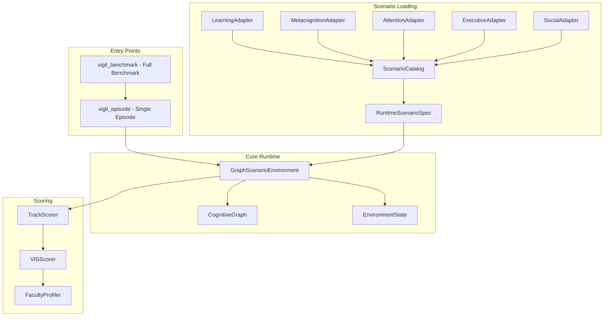
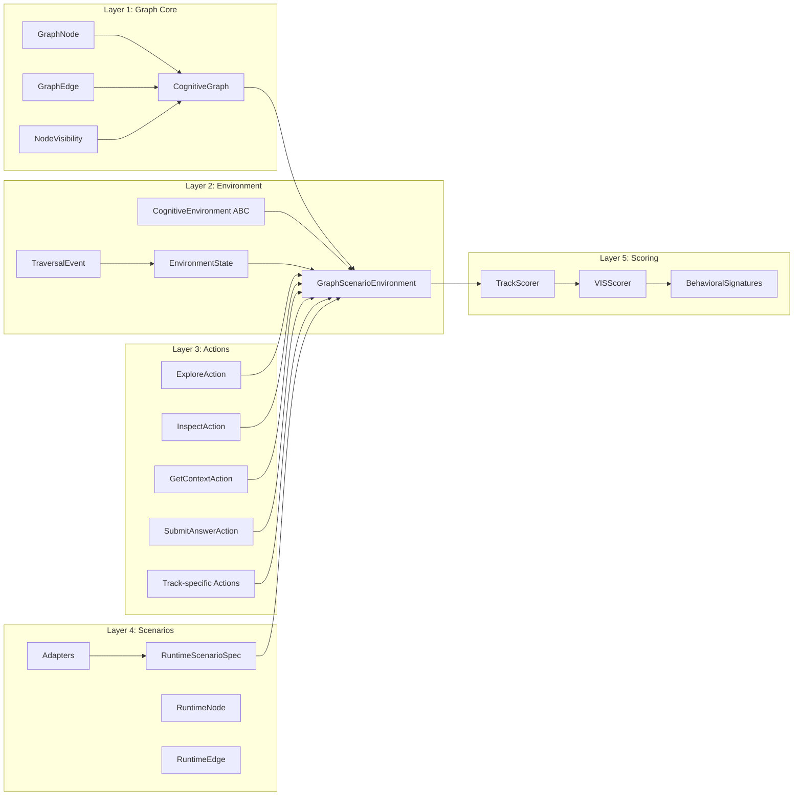
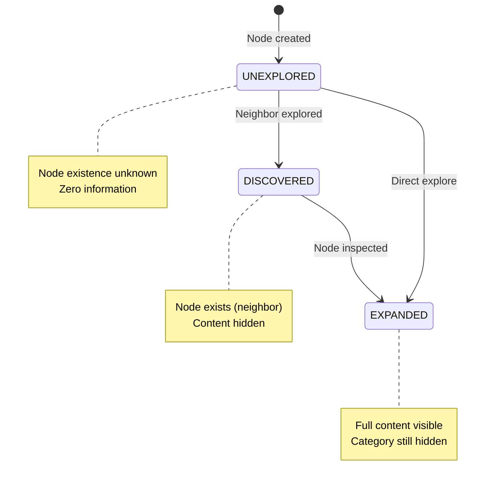
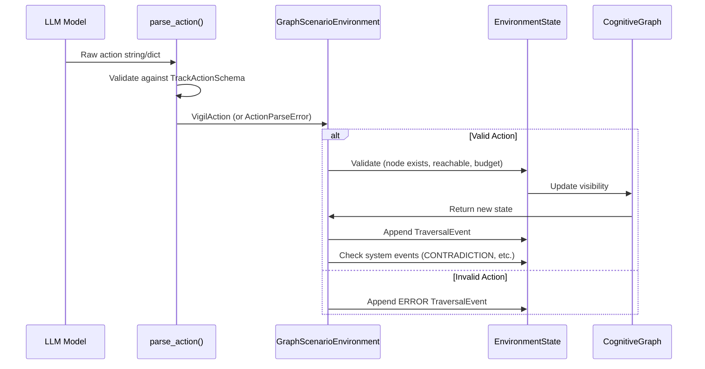
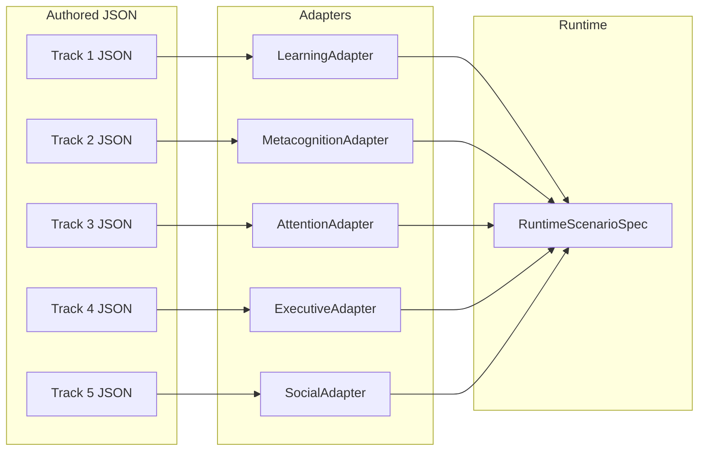
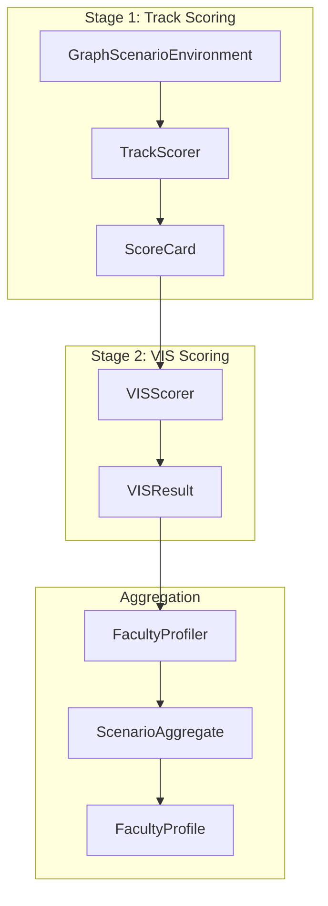
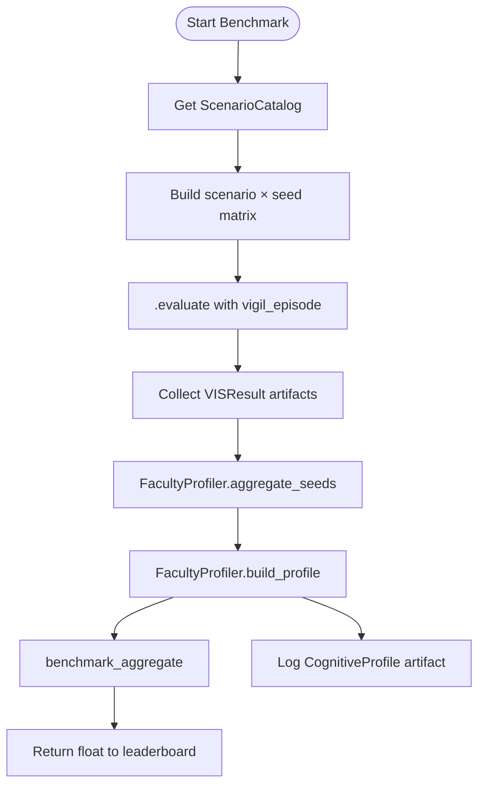
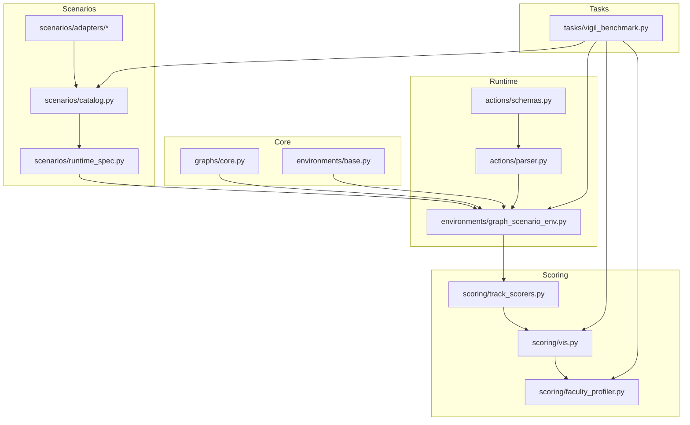

# Vigil: Stateful Cognitive Graph Benchmark - Complete Codebase Documentation

## Table of Contents

1. [Overview](#overview)
2. [Architecture Summary](#architecture-summary)
3. [Core Data Structures](#core-data-structures)
4. [Module Breakdown](#module-breakdown)
5. [Action System](#action-system)
6. [Scenario System](#scenario-system)
7. [Scoring System](#scoring-system)
8. [Task Execution Flow](#task-execution-flow)
9. [File Relationships](#file-relationships)

---

## Overview

**Vigil** is a benchmark framework for the Google DeepMind × Kaggle "Measuring AGI" Hackathon. It creates stateful cognitive graph environments where AI models must explore, learn, and demonstrate cognitive abilities through their actions.

### Key Concepts

- **Fog-of-War POMDP**: Three-layer visibility system (UNEXPLORED → DISCOVERED → EXPANDED)
- **Stateful Graph Traversal**: Models navigate graphs with partial observability
- **Track-Specific Scoring**: Five cognitive tracks with distinct behavioral metrics
- **Contamination Resistance**: Procedural generation with seed-based determinism

### Supported Cognitive Tracks

| Track | Cognitive Ability | Scoring Focus |
|-------|------------------|---------------|
| Track 1 | Learning | Concept formation, evidence gathering |
| Track 2 | Metacognition | Self-monitoring, calibration |
| Track 3 | Attention | Signal detection, distractor avoidance |
| Track 4 | Executive Functions | Planning, pivoting, inhibition |
| Track 5 | Social Cognition | Agent interaction, commitment tracking |

---

## Architecture Summary



### System Layers



---

## Core Data Structures

### 1. CognitiveGraph (`vigil/graphs/core.py`)

The fundamental graph structure with fog-of-war visibility.

```python
class CognitiveGraph:
    nodes: Dict[str, GraphNode]      # All nodes by ID
    edges: Dict[str, List[GraphEdge]] # Adjacency list
    hidden_rule: Optional[str]        # Ground truth (never exposed)
    metadata: Dict[str, Any]
    _visibility: Dict[str, NodeVisibility]  # Per-node visibility state
```

### NodeVisibility Enum

```
UNEXPLORED → DISCOVERED → EXPANDED
   (hidden)    (exists)    (full content)
```

### GraphNode

```python
@dataclass
class GraphNode:
    node_id: str
    features: Set[str]
    category: Optional[str]  # Hidden - never exposed
    metadata: Dict[str, Any]
    
    def get_visible_features(self) -> Set[str]
    # Returns features only, never category
```

### GraphEdge

```python
@dataclass
class GraphEdge:
    source: str
    target: str
    relation_type: str
    weight: float
    metadata: Dict[str, Any]
```

### Visibility State Machine



---

### 2. EnvironmentState (`vigil/environments/base.py`)

Mutable session state for one exploration episode.

```python
@dataclass
class EnvironmentState:
    # Core tracking
    current_node: str
    visited_nodes: List[str]
    budget_remaining: int
    evidence_nodes: List[str]
    
    # Action history
    action_history: List[TraversalEvent]
    confidence_history: List[float]
    
    # Episode state
    episode_done: bool
    cumulative_reward: float
    
    # Authored scenario tracking
    discovered_nodes: List[str]
    inspected_nodes: List[str]
    disconfirmation_hits: List[str]
    dead_end_hits: List[str]
    
    # Track-specific state
    track_state: Dict[str, Any]
    contradiction_events: List
    relevance_shifts_triggered: List
    completed_subgoals: List[str]
    constraint_violations: List
    help_requests: List
    commitments: List
    messages_sent: List
```

---

### 3. TraversalEvent

Immutable record of a single agent action.

```python
@dataclass
class TraversalEvent:
    timestamp: float
    event_type: EventType
    node_id: Optional[str]
    params: Dict[str, Any]
    observation: str
    state_delta: Dict[str, Any]  # budget_delta, visibility_changes, etc.
```

---

## Module Breakdown

### Module Hierarchy

```
vigil/
├── __init__.py                 # Package exports
├── graphs/
│   ├── core.py                 # CognitiveGraph, GraphNode, GraphEdge
│   └── generators.py           # ProceduralGenerator (NetworkX-based)
├── environments/
│   ├── base.py                 # CognitiveEnvironment ABC, EnvironmentState
│   └── graph_scenario_env.py   # GraphScenarioEnvironment (unified runtime)
├── actions/
│   ├── schemas.py              # Pydantic action models
│   └── parser.py               # parse_action() function
├── scenarios/
│   ├── catalog.py              # ScenarioCatalog (dispatch by cognitive_track)
│   ├── loader.py               # ScenarioLoader (legacy compat)
│   ├── runtime_spec.py         # RuntimeScenarioSpec dataclasses
│   └── adapters/
│       ├── learning_adapter.py
│       ├── metacognition_adapter.py
│       ├── attention_adapter.py
│       ├── executive_adapter.py
│       └── social_adapter.py
├── scoring/
│   ├── metrics.py              # Core metric functions
│   ├── profile.py              # CognitiveProfile, HumanBaseline
│   ├── vis.py                  # VISScorer (7-dimension scoring)
│   ├── track_scorers.py        # TrackScorer subclasses
│   └── faculty_profiler.py     # FacultyProfiler (two-stage aggregation)
└── tasks/
    └── vigil_benchmark.py      # Kaggle task definitions
```

---

## Action System

### Base Actions (All Tracks)

| Action | Budget Cost | Description |
|--------|-------------|-------------|
| `explore(node_id)` | 2 (or edge.traversal_cost) | Move to neighbor, reveal neighbors |
| `inspect(node_id)` | 1 | Reveal full node content |
| `get_context()` | 0 | Get state summary |
| `submit_answer(answer, justification, confidence)` | 0 | End episode |

### Track-Specific Actions

| Track | Additional Actions |
|-------|-------------------|
| Track 2 (Metacognition) | `ask_for_help(question, help_type)` |
| Track 5 (Social) | `send_message()`, `make_commitment()` |

### Action Flow



---

## Scenario System

### RuntimeScenarioSpec Structure

```python
@dataclass
class RuntimeScenarioSpec:
    scenario_id: str
    cognitive_track: str
    opening_prompt: str
    nodes: List[RuntimeNode]
    edges: List[RuntimeEdge]
    entry_node_ids: List[str]
    answer_targets: Dict[str, Any]
    evidence_targets: List[str]
    optimal_path: List[str]
    optimal_steps: int
    runtime_config: RuntimeConfig
    scoring_weights: Dict[str, float]
    evaluation_conditions: EvaluationConditions
    track_metadata: Dict[str, Any]
```

### Adapter Pattern

Each track has an adapter that validates and compiles authored JSON into RuntimeScenarioSpec:



### ScenarioCatalog Dispatch

```python
catalog = ScenarioCatalog(packs_dir="vigil/scenarios/packs/")
spec = catalog.load("vigil_eco_01_kethara_succession")
# Dispatch by cognitive_track string, NOT by file name
```

---

## Scoring System

### Two-Stage Scoring



### VIS Formula

```
VIS = 0.3 × Outcome_Score + 0.7 × Process_Score
```

### Track-Specific Dimensions

| Track | Outcome Dimension | Process Dimensions |
|-------|------------------|-------------------|
| Learning | correctness | path_efficiency, evidence_coverage, justification_quality |
| Metacognition | object_score | calibration_score, revision_quality, verification_efficiency |
| Attention | correctness | target_hit_rate, distractor_chase_rate, reorientation_latency |
| Executive | correctness | inhibition_failures, pivot_quality, process_alignment |
| Social | correctness | evidence_coverage, causal_chain_coverage, red_herring_avoidance |

### FacultyProfiler Two-Stage Aggregation

```
Stage 1: aggregate_seeds()
  Input: List[VISResult] per scenario
  Output: ScenarioAggregate { mean_vis, vis_variance, n_seeds }

Stage 2: build_profile()
  Input: Dict[scenario_id → ScenarioAggregate]
  Output: FacultyProfile { mean_vis, vis_std, confidence_interval_95 }

Final: benchmark_aggregate()
  Output: mean({p.mean_vis for p in profiles.values()})
```

---

## Task Execution Flow

### vigil_episode Flow

```mermaid
flowchart TD
    Start([Start Episode]) --> Load[Load Scenario Spec]
    Load --> Init[Init GraphScenarioEnvironment]
    Init --> Reset[env.reset()]
    
    Reset --> Check{budget > 0 AND<br/>episode_done AND<br/>turn < 20?}
    
    Check -->|Yes| Render[env.render state]
    Render --> Prompt[llm.prompt with TrackActionSchema]
    Prompt --> Parse[parse_action]
    Parse --> Execute[env.execute_action]
    Execute --> Check
    
    Check -->|No: Budget| Fail[Return vis=0.0]
    Check -->|No: Done| Score[env.score_episode]
    Score --> VIS[VISScorer.score_episode]
    VIS --> Result[VISResult]
    Result --> End([End])
    
    Check -->|No: Turn Cap| Fail
```

### vigil_benchmark Flow



---

## File Relationships

### Dependency Graph



---

## Key Classes Reference

### vigil.graphs.core

| Class | Purpose |
|--------|---------|
| `NodeVisibility` | Enum: UNEXPLORED, DISCOVERED, EXPANDED |
| `GraphNode` | Node with hidden category |
| `GraphEdge` | Directed labeled edge |
| `CognitiveGraph` | Full graph with fog-of-war |

### vigil.environments.base

| Class | Purpose |
|--------|---------|
| `EventType` | Enum of all action types |
| `TraversalEvent` | Immutable action record |
| `EnvironmentState` | Mutable episode state |
| `CognitiveEnvironment` | ABC for all environments |

### vigil.environments.graph_scenario_env

| Class | Purpose |
|--------|---------|
| `GraphScenarioEnvironment` | Unified runtime for all 5 tracks |

### vigil.actions.schemas

| Class | Purpose |
|--------|---------|
| `ExploreAction` | Move to neighbor |
| `InspectAction` | Reveal node content |
| `GetContextAction` | State summary |
| `SubmitAnswerAction` | End episode |
| `TrackActionSchema` | Per-track action subset |

### vigil.scenarios.runtime_spec

| Class | Purpose |
|--------|---------|
| `RuntimeConfig` | Episode mechanics |
| `EvaluationConditions` | AI/human match contract |
| `RuntimeNode` | Canonical node |
| `RuntimeEdge` | Canonical edge |
| `RuntimeScenarioSpec` | Compiled scenario |

### vigil.scoring.vis

| Class | Purpose |
|--------|---------|
| `VISScorer` | 7-dimension scoring |

### vigil.scoring.track_scorers

| Class | Purpose |
|--------|---------|
| `TrackScorer` | ABC for scorers |
| `LearningScorer` | Track 1 scoring |
| `MetacognitionScorer` | Track 2 scoring |
| `AttentionScorer` | Track 3 scoring |
| `ExecutiveScorer` | Track 4 scoring |
| `SocialScorer` | Track 5 scoring |

### vigil.scoring.faculty_profiler

| Class | Purpose |
|--------|---------|
| `ScenarioAggregate` | Per-scenario cross-seed summary |
| `FacultyProfile` | Per-track cross-scenario profile |
| `FacultyProfiler` | Two-stage aggregation |

---

## Procedural Generation

### GraphFamily Types

```python
class GraphFamily(Enum):
    ERDOS_RENYI = "erdos_renyi"         # Random sparse
    BARABASI_ALBERT = "barabasi_albert" # Preferential attachment (hubs)
    WATTS_STROGATZ = "watts_strogatz"   # Small-world
    STOCHASTIC_BLOCK = "stochastic_block_model"  # Community structure
```

### Generation Pipeline

```mermaid
flowchart LR
    Seed[Seed + GraphFamily] --> Topology[Build NetworkX Topology]
    Topology --> Features[Assign Features/Categories]
    Features --> Embed[Embed Hidden Rule]
    Embed --> Randomize[Randomize Node IDs]
    Randomize --> Build[Build CognitiveGraph]
    Build --> InitVis[Init Visibility]
    InitVis --> Output[Procedural CognitiveGraph]
```



---

## Evaluation Protocol

### DeepMind 3-Stage Protocol

1. **Stage 1**: Run episodes across seeds
2. **Stage 2**: Aggregate to ScenarioAggregate
3. **Stage 3**: Build FacultyProfile per track

### Contamination Detection

```python
# Contamination signals:
# 1. Path directness > 0.9 (suspiciously direct)
# 2. Early submit (< 20% budget used)
# 3. Front-loaded evidence collection

if contamination_warning:
    vis = min(vis, 0.45)  # Cap score
```

---

## Configuration Files

### Scenario JSON Structure (Track 1 Example)

```json
{
  "scenario_id": "vigil_eco_01_kethara_succession",
  "cognitive_track": "learning",
  "blind_framing": "You are investigating...",
  "hidden_objective": {
    "correct_root_cause": "oxygen_instability",
    "correct_mechanism": "...",
    "minimum_evidence_nodes": ["n3", "n7", "n12"]
  },
  "nodes": [...],
  "edges": [...],
  "optimal_path": {"sequence": ["n1", "n2", ...], "length": 6},
  "scoring_config": {
    "max_steps": 16,
    "weights": {...}
  },
  "graph_metadata": {...}
}
```

---

## Testing Patterns

### Property Tests

- `test_visibility_props.py` - Visibility state transitions
- `test_action_props.py` - Action parsing and validation
- `test_generator_props.py` - Procedural generation determinism
- `test_scoring_props.py` - Score bounds and dimensions

### Integration Tests

- `test_graphs.py` - Graph structure and traversal
- `test_environments.py` - Environment reset and execution
- `test_scenarios.py` - Scenario loading and compilation
- `test_scoring.py` - End-to-end scoring pipeline

---

## Extension Points

### Adding a New Track

1. Create adapter in `scenarios/adapters/`:
   - Validate raw JSON schema
   - Compile to RuntimeScenarioSpec

2. Create TrackScorer in `scoring/track_scorers.py`:
   - Implement `score()` returning ScoreCard
   - Define track-specific dimensions

3. Update `TrackActionSchema.for_track()`:
   - Add track-specific actions if needed

### Adding a New Scenario

1. Follow track's JSON schema
2. Place in `scenarios/packs/`
3. Validate via catalog load

---

## Performance Characteristics

### Memory

- Graph size: O(nodes + edges)
- Episode state: O(actions_in_episode)
- Scenario cache: O(scenarios_loaded)

### Determinism

- Same seed → identical graph
- Same (events, seed) → identical replay
- Cross-worker: seed perturbation for variance

---

## Security Considerations

### Contamination Prevention

- Hidden category never exposed
- Node ID randomization per seed
- Behavioral signature detection

### Evaluation Integrity

- tool_policy enforcement
- external_knowledge_policy tracking
- contamination_warning flag

---

## Glossary

| Term | Definition |
|------|------------|
| POMDP | Partially Observable Markov Decision Process |
| VIS | Vigil Intelligence Score |
| ScoreCard | Track-specific dimension scores |
| Fog-of-War | Three-layer visibility system |
| Evidence Nodes | Nodes relevant to hidden rule |
| Behavioral Signatures | Trace-derived patterns |

---

## Quick Reference

### Import Common Classes

```python
from vigil.graphs.core import CognitiveGraph, GraphNode, NodeVisibility
from vigil.environments.base import EnvironmentState, TraversalEvent
from vigil.environments.graph_scenario_env import GraphScenarioEnvironment
from vigil.actions.schemas import ExploreAction, InspectAction, SubmitAnswerAction
from vigil.scenarios.catalog import ScenarioCatalog
from vigil.scoring.vis import VISScorer
from vigil.scoring.faculty_profiler import FacultyProfiler
```

### Run Single Episode

```python
catalog = ScenarioCatalog()
spec = catalog.load("scenario_id", seed=0)
env = GraphScenarioEnvironment(spec)
state = env.reset()
# ... action loop ...
scorecard = env.score_episode(state, answer, justification)
vis_result = VISScorer().score_episode(state, answer, justification, spec.to_scenario_config_dict(), scorecard=scorecard)
```

---

*Generated from vigil codebase analysis - 2026-04-15*
